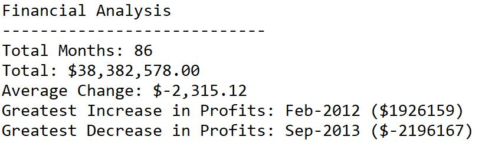
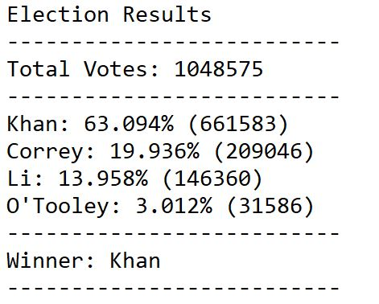

# Python-Challenge: PyBank &amp; PyPoll

## About the Challenge: PyBank 

In this project I have analyzed financial records from a company. The Data consists of "Monthly Profits & Losses". Using Python Code, I have read the data to determine the Total Revenue of the company over 7year time period. I have calculated the average change in Profits& Losses. Also, I have determined the month and year with the greatest increase to profits and the month and year with the greatest decrease.

In my code, I used extra formatting to change my results into currency which made the integers to 2decemial places. I also added a ‘join’ command in lines 38 and 39 to print the results of the Greatest Increase and Greatest Decrease with the full 4digit year showing. The data only contained a 2digit year abbreviation. 

I combined my results as a ‘string’ variable so that I was easily able to print the results to Terminal as well as an outside .txt file. 

**Please see my below Results for PyBank:**

_______________________________________________________________________________________________________________________________________________

## About the Challenge: PyPoll**

In this project I have analyzed election data for a small rural town to help them determine the winner of their election. This is a truly relevant coding project with the upcoming election this November. Using Python I was able to evaluate the total number of votes cast in the election, the total number of votes cast for each candidate, and the percentage of the votes that each candidate received. 

In order to print the results of the election by candidate, I created a code that ran through a For Loop and added to the “results” string variable. To make this work, I needed to open my csv file using the ‘r’ code instead of a ‘with open()’. By reading the csv file this way, I was able to interrupt my data reading without breaking the string of the ‘open with()’ command. I also used a ‘get’ function to access the Key candidate name and total votes in my dictionary of total votes. This allowed me to print the name and the results in the same command. I used a ‘round’ command to format my candidate percent value in row 40 to return the integer % value to 3 decimal points. 

In this election, the candidate Khan was the winner with 63% of the votes. 

**Please see my below Results for PyPoll:**

